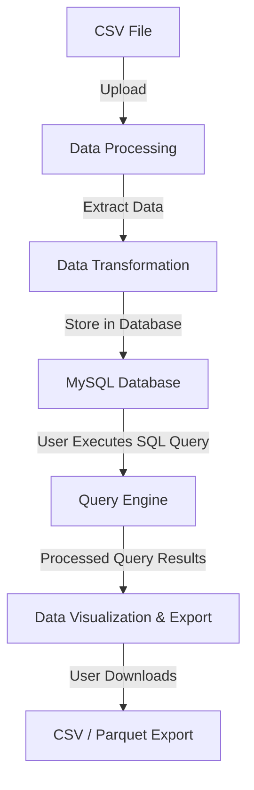
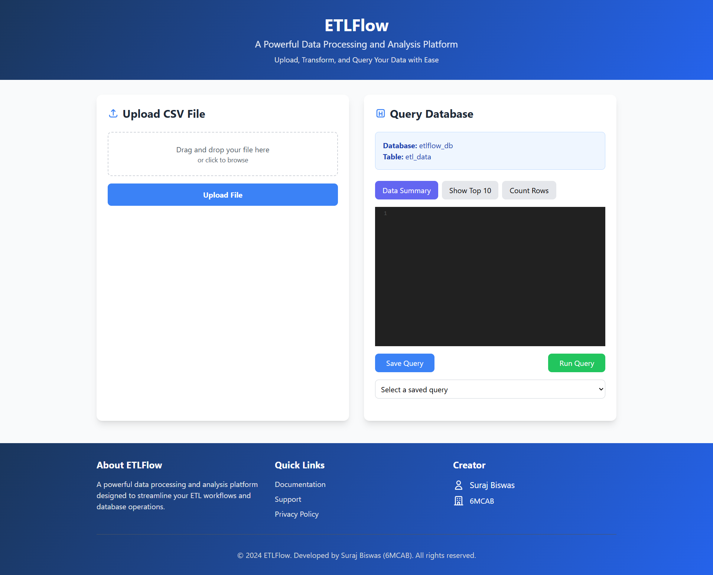
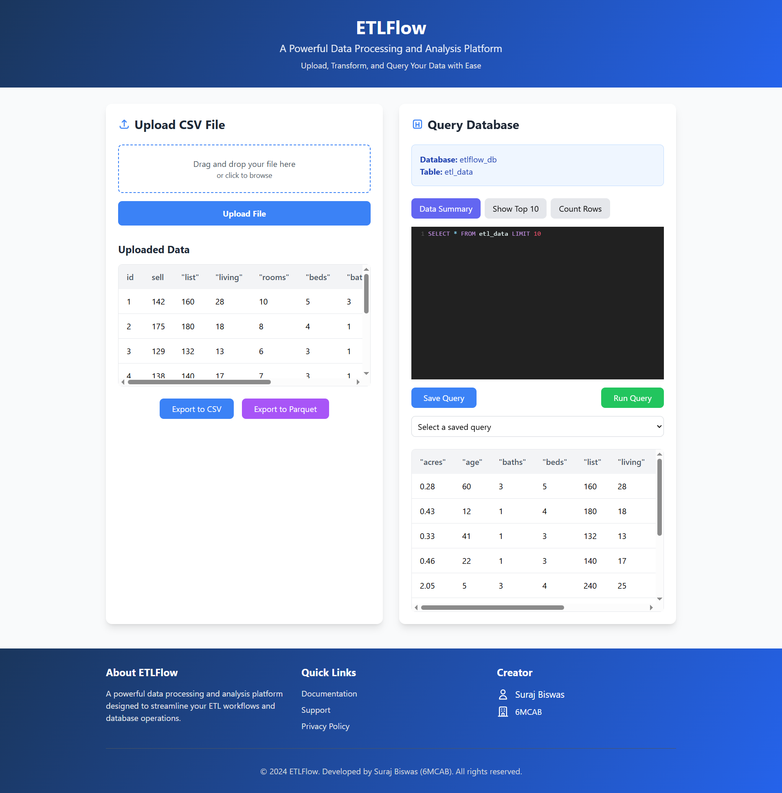
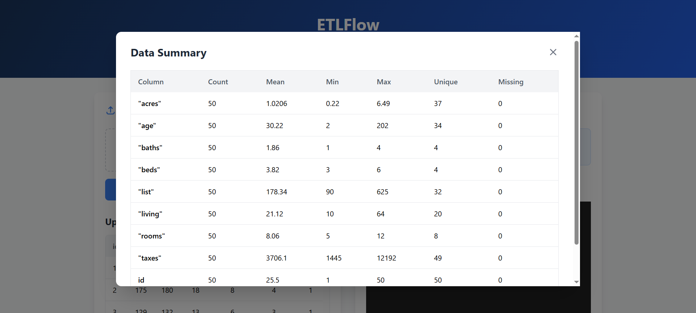

## ETLFlow

ETLFlow is a lightweight and efficient Extract, Transform, and Load (ETL) pipeline built using Python. This project automates the process of data extraction, transformation, and loading, making it easier to handle and process large datasets efficiently.

### Features
- **No-Code ETL:** Process data with just a file upload.
- **Pre-built Transformations:** Handle missing values, renaming columns, filtering.
- **SQL Query Execution:** Users can run queries without deep technical knowledge.
- **Data Export:** Download processed data in CSV/Parquet format.
- **User-Friendly Interface:** Simple UI for all users.

### Installation

To use ETLFlow, first clone the repository and install the required dependencies:

```sh
# Clone the repository
git clone https://github.com/Suraj-Biswas23/ETLFlow.git
cd ETLFlow

# Create a virtual environment (optional but recommended)
python -m venv venv
source venv/bin/activate  # On Windows use `venv\Scripts\activate`

# Install dependencies
pip install -r requirements.txt
```
### ETLFlow Data Flow Diagram (DFD)



## Screenshots

### ETL Homepage


### CSV Uploaded


### Data Summary

